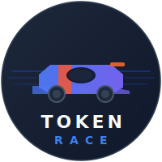

<div align="center">



# TokenRace

**팀의 Claude Code 토큰 사용량을 F1 레이싱처럼 실시간으로 추적**

[](https://tokenrace.baeksang.dev)
[](#-라이선스)
[](https://tokenrace.baeksang.dev)

<br />

### [🌐 라이브 데모](https://tokenrace.baeksang.dev) &nbsp;·&nbsp; [⚡ 1분 시작](#-1분-시작) &nbsp;·&nbsp; [🎯 가입하기](https://tokenrace.baeksang.dev/ko/signup)

<br />

> 팀이 한 달에 Claude Code에 얼마를 쓰는지, 누가 토큰을 가장 많이 태우는지,
> 어떤 모델이 비용 대부분을 차지하는지 — 5초마다 갱신되는 리더보드로 한눈에.

</div>

---

## 🤔 이게 뭐냐

```
"이번 주 누가 Sonnet 100만 토큰 넘게 썼지?"      — 모름
"우리 팀 Claude Code 비용 추세 좀 보여줘"          — 가공할 데이터 없음
"Opus랑 Sonnet 어느 게 비용 효율 좋아?"           — 감으로 답함
"Bob이 어제 Claude Code 썼나?"                    — Slack DM 보내야 알 수 있음
```

Claude Code는 OpenTelemetry로 모든 메트릭을 뽑아준다. **TokenRace는 그걸 받아서 팀이 볼 수 있게 시각화한다.** 그게 전부.

복잡한 셋업 없음. 결제 없음. 무료. 5초마다 자동 갱신.

---

## ⚡ 1분 시작

### 1️⃣ GitHub로 1초 로그인

[**tokenrace.baeksang.dev**](https://tokenrace.baeksang.dev) 접속 → **GitHub로 가입** → 조직 이름 한 번 입력. 끝.

### 2️⃣ 팀원 초대 (선택)

대시보드 → **팀 관리** → 이메일 입력 → **초대 링크 복사** → 슬랙/메신저로 전송.
받은 사람은 같은 GitHub 이메일로 로그인 한 번이면 자동 가입.

### 3️⃣ 에이전트 설치 (1분)

```bash
# 한 줄 설치 (macOS / Linux × arm64 / amd64 자동 감지)
curl -sSL https://tokenrace.baeksang.dev/install.sh | sh

# 인터랙티브 init (브라우저 자동 오픈 + 키 페이스트 안내)
token-race init
```

다음 Claude Code 세션이 끝나면 **자동으로** 리더보드에 등록됨. 이후 영구 자동 동기화.

---

## ✨ 기능

| | 기능 | 설명 |
|--|------|------|
| 🏎 | **F1 스타일 리더보드** | 드라이버(개인) ↔ 컨스트럭터(팀) 토글, 5/60초 폴링, FL/포디움/델타 |
| ⚡ | **Zero-config 수집** | Claude Code Stop Hook 자동 등록 → 매 세션 종료 시 자동 전송 |
| 🏢 | **3-tier 멀티테넌시** | Organization → Team → User + RBAC (org_owner / team_manager / member) |
| 🎫 | **GitHub OAuth-only** | 비밀번호 없음. GitHub 이메일/이름/아바타만 사용, 저장소 접근 X |
| 🔗 | **256-bit 초대 토큰** | 14일 유효, 1회용, 이메일 미스매치 자동 거부 |
| 📊 | **실시간 통계** | 토큰·비용·세션·이벤트, 24h burn-rate, 모델별 분배, 일/주/월 트렌드 |
| 🌐 | **다국어** | 한국어 / English (자동 감지 + 토글) |
| 🛡 | **API key SHA-256** | Plaintext 키는 발급 시 1회만 표시, DB는 해시만 저장 |

---

## 🎯 누구를 위한 도구인가

✅ **Claude Code를 팀 단위로 쓰는 엔지니어링 조직**
- 5명 이상이 매일 Claude Code 사용
- 누가/언제/얼마나 쓰는지 가시성이 필요한 팀
- Anthropic 청구서가 어디서 새는지 알고 싶은 매니저

❌ **이런 경우엔 필요 없음**
- 혼자 Claude Code 쓰는 개인 (Anthropic 콘솔에 다 나옴)
- 팀이 Claude Code를 쓰지 않는 경우

---

## 📸 미리보기

| F1 리더보드 | 팀 분석 |
|:-:|:-:|
| 5초마다 자동 갱신, 드라이버 ↔ 컨스트럭터 전환 | 팀별 토큰/비용/세션, 점유율 시각화 |

🎬 [**라이브로 직접 보기 →**](https://tokenrace.baeksang.dev)

---

## 💰 가격

```
무료. 영구. 무제한.
- 조직 무제한
- 멤버 무제한
- 데이터 보관 무제한
- API 키 무제한
```

스폰서십이나 셀프호스팅 문의는 [GitHub Discussions](https://github.com/Mrbaeksang/token-race/discussions) 또는 [me@baeksang.dev](mailto:me@baeksang.dev)로.

---

## 🛡 프라이버시

저장하는 것:
- ✅ 토큰 사용량 (input / output / cache)
- ✅ 모델명 · 세션 ID · 프로젝트 경로
- ✅ Git branch (선택) · 비용 (메트릭만)

**저장하지 않는 것:**
- ❌ 프롬프트 본문
- ❌ Claude의 응답
- ❌ 코드 내용
- ❌ GitHub 저장소 접근

OAuth는 `read:user` + `user:email` 스코프만 요청 — 저장소 접근 권한 0.

---

## 🌐 라이브

- **웹:** [tokenrace.baeksang.dev](https://tokenrace.baeksang.dev)
- **에이전트 릴리스:** [GitHub Releases](https://github.com/Mrbaeksang/tokenrace/releases?q=agent-v)
- **이슈/제안:** [GitHub Issues](https://github.com/Mrbaeksang/token-race/issues)

---

## 📈 Star History

<div align="center">

[](https://star-history.com/#Mrbaeksang/token-race&Date)

</div>

---

## 📄 라이선스

[MIT License](LICENSE) — 자유롭게 사용, 수정, 상업적 사용 가능.

---

<div align="center">

**TokenRace** · [tokenrace.baeksang.dev](https://tokenrace.baeksang.dev) · Made by [@Mrbaeksang](https://github.com/Mrbaeksang)

<sub>Claude Code로 만들었고, 매일 직접 씁니다.</sub>

</div>
